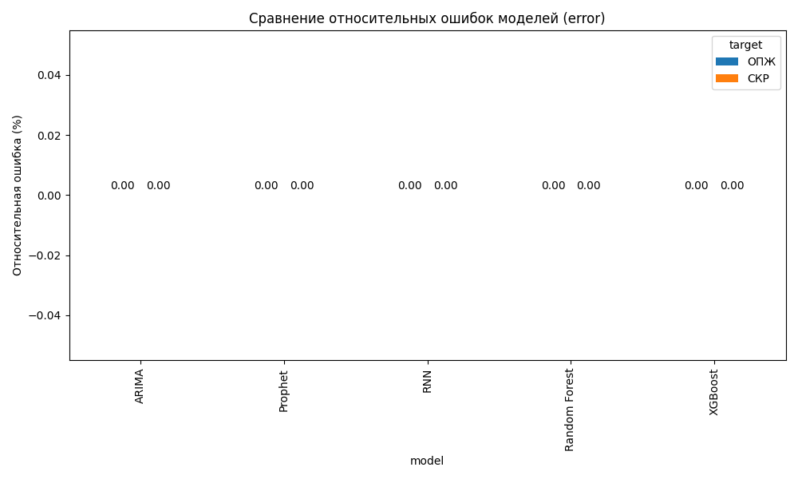
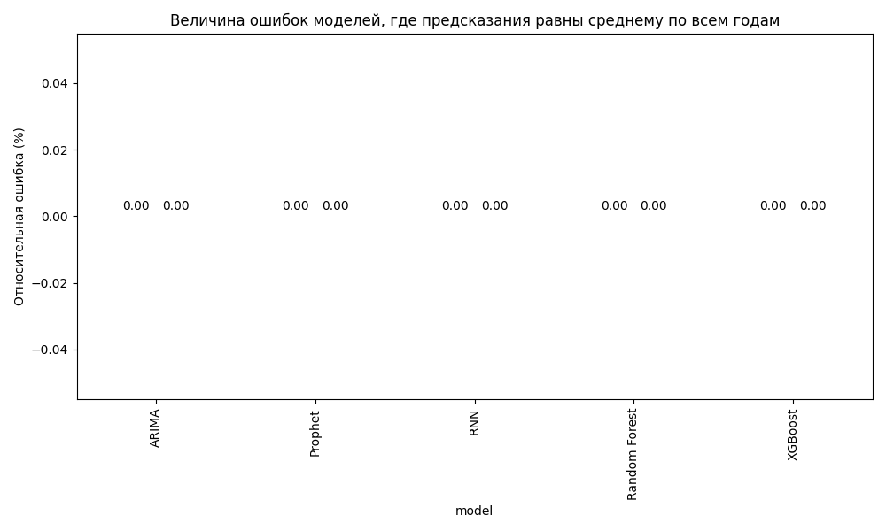

# Отчёт по моделям
## Модель: ARIMA — СКР
```
====================================================================================================
Отклонение таргета относительно прогноза:
RMSE: 0.0593
MAE: 0.0445
R²: 0.9544
Средний СКР: 1.4329
Относительная ошибка: 4.14%
====================================================================================================
Отклонение таргета относительно СРЕДНЕГО:
RMSE: 0.3348
MAE: 0.2725
R²: -0.4538
Средний СКР: 1.4329
Относительная ошибка: 23.37%
====================================================================================================
{"RMSE": 0.05926621495670294, "MAE": 0.04445411764705883, "R2": 0.9544499972734612, "relative_error": 4.136024551407526, "relative_average": 23.366633676905913}
```

## Модель: ARIMA — ОПЖ
```
====================================================================================================
Отклонение таргета относительно прогноза:
RMSE: 0.8804
MAE: 0.7063
R²: 0.8856
Средний ОПЖ: 72.4341
Относительная ошибка: 1.22%
====================================================================================================
Отклонение таргета относительно СРЕДНЕГО:
RMSE: 2.8435
MAE: 2.1326
R²: -0.1932
Средний ОПЖ: 72.4341
Относительная ошибка: 3.93%
====================================================================================================
{"RMSE": 0.880369612552525, "MAE": 0.7062552941176471, "R2": 0.8856220471199727, "relative_error": 1.2154073814251432, "relative_average": 3.9255724713872944}
```

## Модель: Prophet — СКР
```
====================================================================================================
Отклонение таргета относительно прогноза:
RMSE: 0.0804
MAE: 0.0626
R²: 0.9166
Средний СКР: 1.4430
Относительная ошибка: 5.57%
====================================================================================================
Отклонение таргета относительно СРЕДНЕГО:
RMSE: 0.3299
MAE: 0.2663
R²: -0.4045
Средний СКР: 1.4430
Относительная ошибка: 22.86%
====================================================================================================
{"RMSE": 0.08039634474917264, "MAE": 0.06261784104002265, "R2": 0.9165793307910134, "relative_error": 5.57158582473221, "relative_average": 22.86120035365979}
```

## Модель: Prophet — ОПЖ
```
====================================================================================================
Отклонение таргета относительно прогноза:
RMSE: 5.1509
MAE: 4.8807
R²: -3.2340
Средний ОПЖ: 72.1126
Относительная ошибка: 7.14%
====================================================================================================
Отклонение таргета относительно СРЕДНЕГО:
RMSE: 2.6350
MAE: 1.9764
R²: -0.1080
Средний ОПЖ: 72.1126
Относительная ошибка: 3.65%
====================================================================================================
{"RMSE": 5.150934069517236, "MAE": 4.880674739778387, "R2": -3.233954240499953, "relative_error": 7.142899726473126, "relative_average": 3.6540144304911046}
```

## Модель: Random Forest — СКР
```
====================================================================================================
Отклонение таргета относительно прогноза:
RMSE: 0.0393
MAE: 0.0292
R²: 0.9796
Средний СКР: 1.4365
Относительная ошибка: 2.74%
====================================================================================================
Отклонение таргета относительно СРЕДНЕГО:
RMSE: 0.3311
MAE: 0.2689
R²: -0.4436
Средний СКР: 1.4365
Относительная ошибка: 23.05%
====================================================================================================
{"RMSE": 0.03932620591272432, "MAE": 0.029168101179533782, "R2": 0.9796317627567215, "relative_error": 2.7376965623108656, "relative_average": 23.04800988295015}
```

## Модель: Random Forest — ОПЖ
```
====================================================================================================
Отклонение таргета относительно прогноза:
RMSE: 0.6832
MAE: 0.5865
R²: 0.9311
Средний ОПЖ: 72.4341
Относительная ошибка: 0.94%
====================================================================================================
Отклонение таргета относительно СРЕДНЕГО:
RMSE: 2.8435
MAE: 2.1326
R²: -0.1932
Средний ОПЖ: 72.4341
Относительная ошибка: 3.93%
====================================================================================================
{"RMSE": 0.6831684827920756, "MAE": 0.5864823301127474, "R2": 0.931124006433729, "relative_error": 0.9431584244884023, "relative_average": 3.9255724713872944}
```

## Модель: RNN — СКР
```
====================================================================================================
Отклонение таргета относительно прогноза:
RMSE: 0.3222
MAE: 0.2514
R²: -0.3402
Средний СКР: 1.4430
Относительная ошибка: 22.33%
====================================================================================================
Отклонение таргета относительно СРЕДНЕГО:
RMSE: 0.3299
MAE: 0.2663
R²: -0.4045
Средний СКР: 1.4430
Относительная ошибка: 22.86%
====================================================================================================
{"RMSE": 0.3222381223996383, "MAE": 0.25142352362801046, "R2": -0.3401545911682544, "relative_error": 22.331579384007057, "relative_average": 22.86120035365979}
```

## Модель: RNN — ОПЖ
```
====================================================================================================
Отклонение таргета относительно прогноза:
RMSE: 3.2670
MAE: 2.6163
R²: -0.7032
Средний ОПЖ: 72.1126
Относительная ошибка: 4.53%
====================================================================================================
Отклонение таргета относительно СРЕДНЕГО:
RMSE: 2.6350
MAE: 1.9764
R²: -0.1080
Средний ОПЖ: 72.1126
Относительная ошибка: 3.65%
====================================================================================================
{"RMSE": 3.2670192967283587, "MAE": 2.6162766813390395, "R2": -0.7032467821757102, "relative_error": 4.530438737137739, "relative_average": 3.6540144304911046}
```

## Модель: XGBoost — СКР
```
====================================================================================================
Отклонение таргета относительно прогноза:
RMSE: 0.0316
MAE: 0.0240
R²: 0.9869
Средний СКР: 1.4365
Относительная ошибка: 2.20%
====================================================================================================
Отклонение таргета относительно СРЕДНЕГО:
RMSE: 0.3311
MAE: 0.2689
R²: -0.4436
Средний СКР: 1.4365
Относительная ошибка: 23.05%
====================================================================================================
{"RMSE": 0.031577557563355854, "MAE": 0.023965081697351762, "R2": 0.9868675299764527, "relative_error": 2.1982738680468854, "relative_average": 23.04800988295015}
```

## Модель: XGBoost — ОПЖ
```
====================================================================================================
Отклонение таргета относительно прогноза:
RMSE: 0.8215
MAE: 0.7429
R²: 0.9004
Средний ОПЖ: 72.4341
Относительная ошибка: 1.13%
====================================================================================================
Отклонение таргета относительно СРЕДНЕГО:
RMSE: 2.8435
MAE: 2.1326
R²: -0.1932
Средний ОПЖ: 72.4341
Относительная ошибка: 3.93%
====================================================================================================
{"RMSE": 0.8214864661036654, "MAE": 0.7429433773265169, "R2": 0.9004106133538248, "relative_error": 1.1341153765500749, "relative_average": 3.9255724713872944}
```

## Диаграмма относительных ошибок


